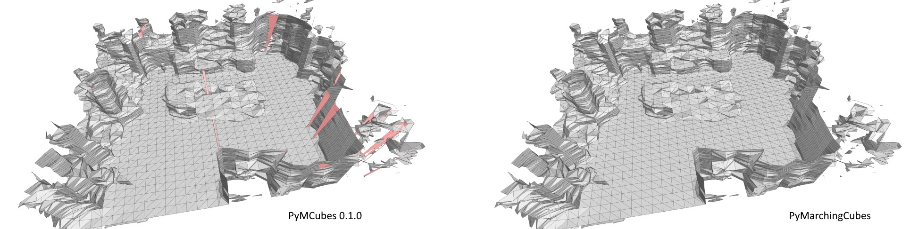
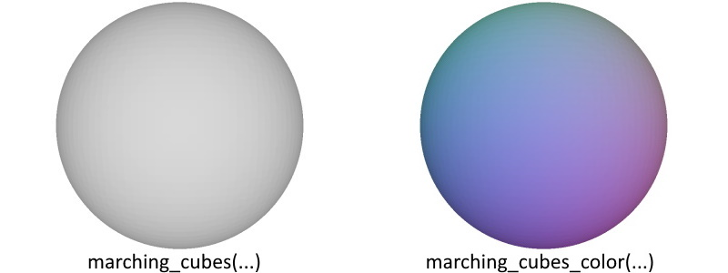
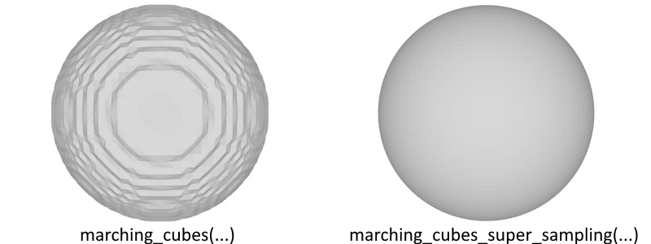

# PyMarchingCubes

`PyMarchingCubes` is a fork from `PyMCubes`, with a different implementation of the actual marching function (see 'marching_cubes/src/marchingcubes.h').
It fixes some issues of the original implementation that let to wrong triangulation (visible in triangles that are larger than the actual 'marching cell').



### Color Interpolation
The module also includes a marching cubes with color interpolation:
``` marching_cubes_color ``` and ``` marching_cubes_color_func ```.
Have a look at the 'examples/spheres.py' file.
Basically, it is called with ``` marching_cubes_color(sdf_volume, rgb_volume, iso_level) ``` assuming a 3D grid for the sdf values (dim_x,dim_y,dim_z) and a 4D grid for the colors (dim_x,dim_y,dim_z,3).



The export functions for obj and off files are adapted accordingly to handle the vertex colors.


### Super sampling along the edges
In case you are using a truncated signed distance function, you might miss the correct zero-crossing because of undersampling. Increasing the sample volume grows cubically, instead one can also subsample along the edges of a coarser volume to find a better approximation of the zero-crossing.
This subsampling of the edges is achieved by sampling along the x,y,z axis independently with higher resolution (e.g., you sample (dim_x + (dim_x-1)*edge_sampling, dim_y, dim_z) for the edges along the x axis).
The computational cost grow linear with the number of subsamples (e.g. 10 subsamples result in ~30 times more samples that you have to provide (since you need 10 times more samples per axis)).
A modified marching cubes implementation can be called via ``` marching_cubes_super_sampling(sdf_x, sdf_y, sdf_z, iso_level) ```.
Have a look at the sphere example.




Other than that, this repository is the same as the original (https://github.com/pmneila/PyMCubes).

## Installation

```
pip install git+https://github.com/YuliangXiu/mcubes.git
```